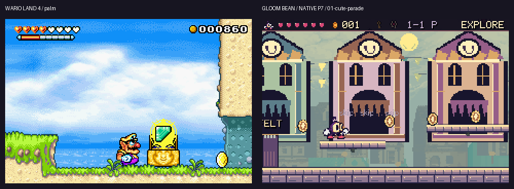
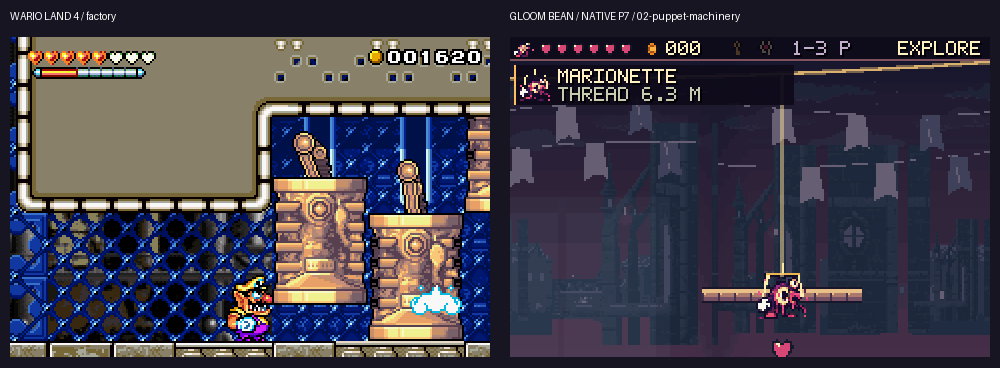
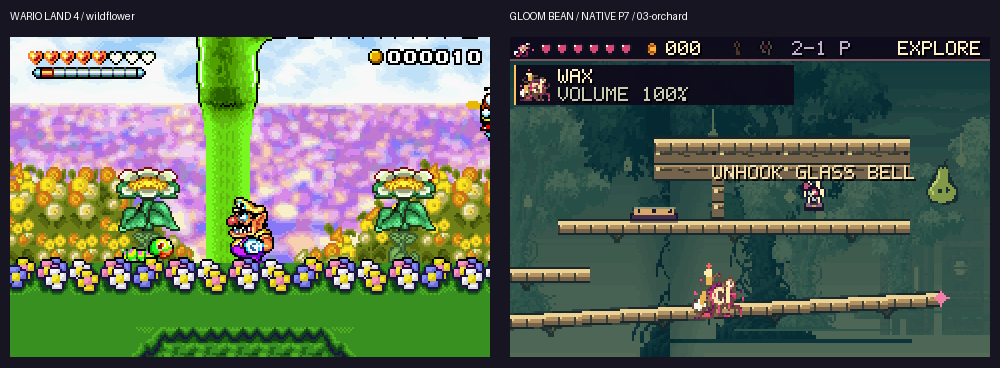
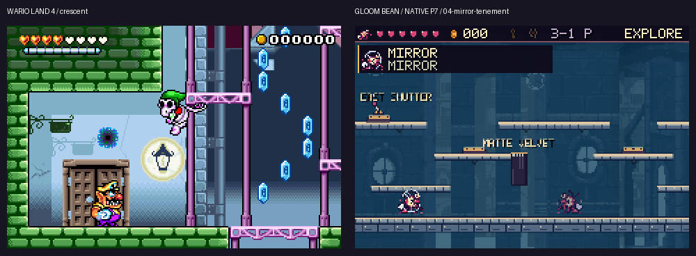
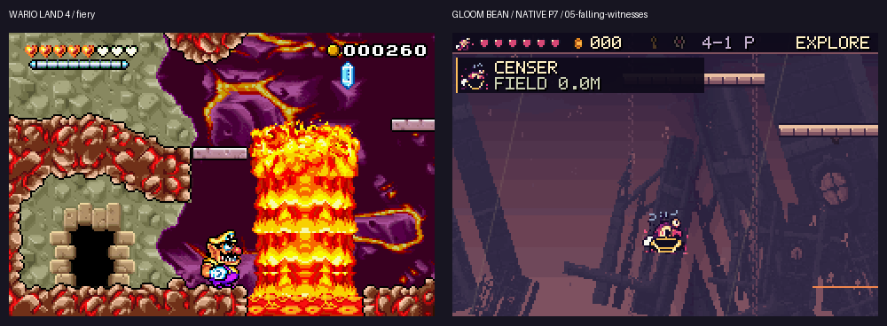
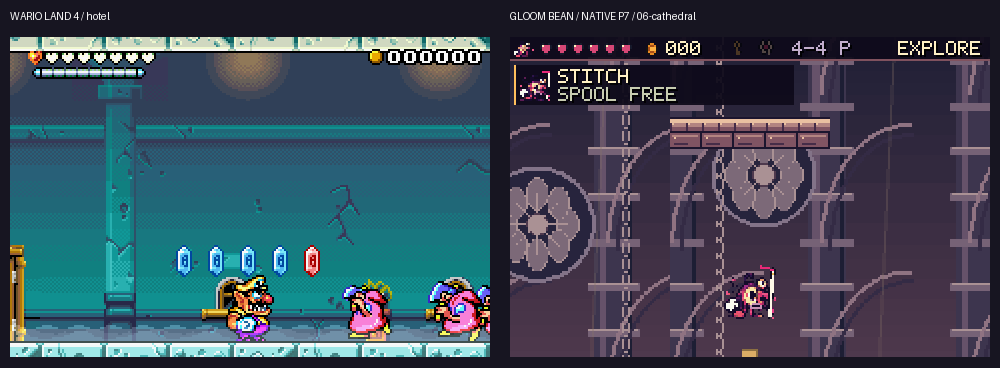
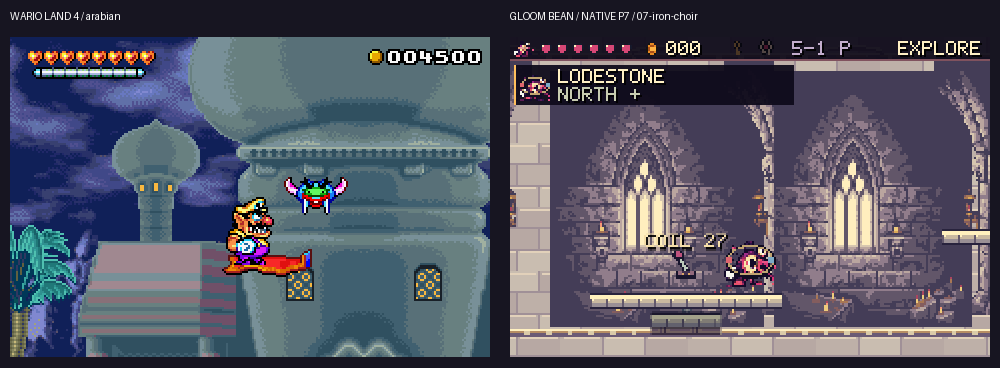
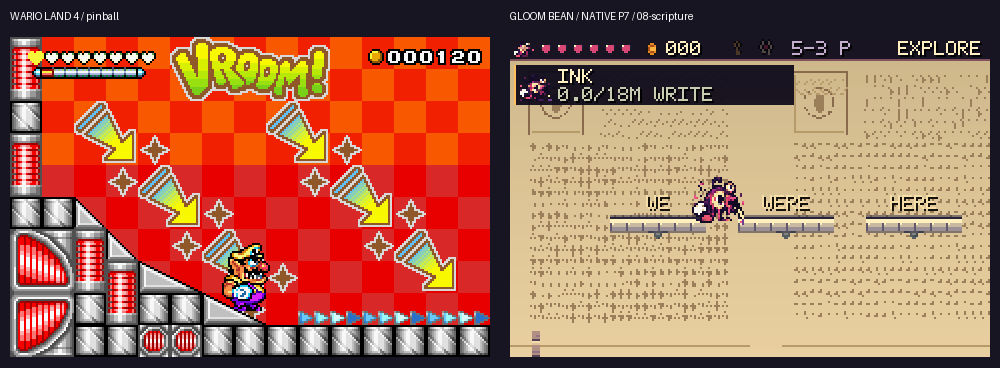
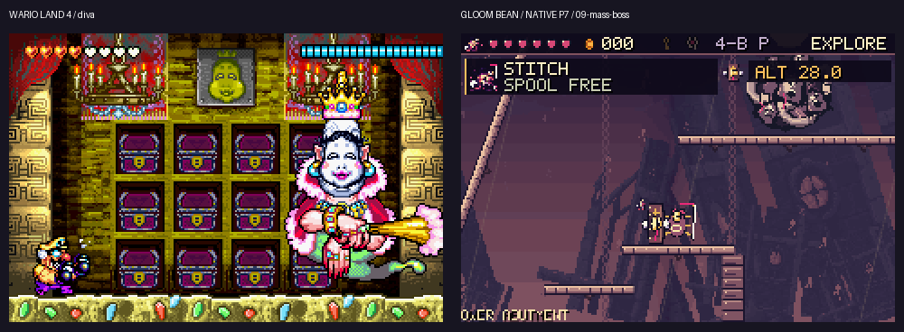
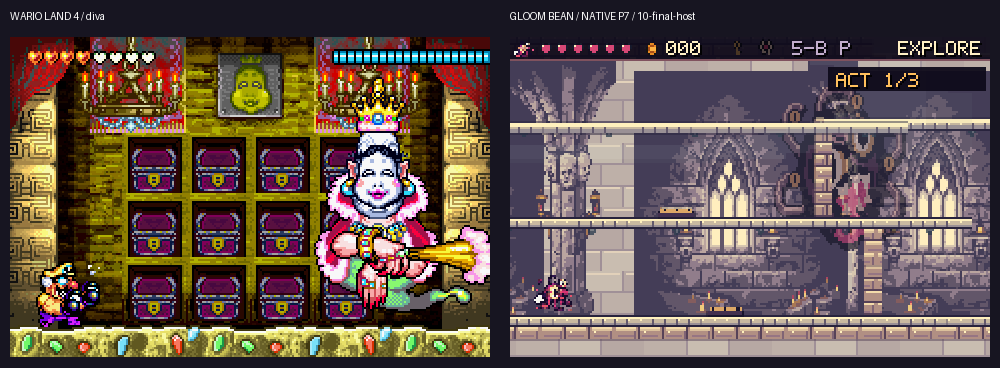

# V6 GBA visual review — strict superiority remains unmet

These are single-reviewer ordinal still-image grades, not objective measurements or a human panel. All ten predetermined examples remain, including sparse or weaker frames. Art fixtures stage actors and are not route proofs. Actual input-driven action evidence is recorded separately.

| Scene | Pre-GBA S/C/C/P | Current P7 | WL4 | Verdict |
|---|---|---|---|---|
| Sunday Best | 2.5 / 2.5 / 2.5 / 2.5 | 3.5 / 3 / 4 / 3.5 | 4.5 / 4.5 / 4.5 / 4.5 | WL4 leads |
| The Puppet Laundry | 2.5 / 2.5 / 2.5 / 2.5 | 3 / 3 / 3.5 / 3 | 4.5 / 4.5 / 4.5 / 4.5 | WL4 leads |
| Pear Tree Gallows | 2.5 / 2.5 / 2.5 / 2.5 | 3.5 / 3 / 3.5 / 3 | 4.5 / 4.5 / 4.5 / 4.5 | WL4 leads |
| Tenement of Two Suns | 2.5 / 2 / 2.5 / 2.5 | 3 / 3 / 3.5 / 3 | 4.5 / 4.5 / 4.5 / 4.5 | WL4 leads |
| Rain of Kneeling Men | 2.5 / 2.5 / 2 / 2.5 | 3 / 3 / 3 / 3 | 5 / 4.5 / 4.5 / 5 | WL4 leads |
| Cathedral in Freefall | 2.5 / 2.5 / 2.5 / 2.5 | 3.5 / 3 / 3.5 / 3 | 4 / 4.5 / 4.5 / 4.5 | WL4 leads |
| Choir of Iron Halos | 2.5 / 2.5 / 2.5 / 2.5 | 3.5 / 3 / 4 / 3.5 | 4.5 / 4.5 / 4.5 / 4.5 | WL4 leads |
| Scripture That Writes Back | 2.5 / 2.5 / 2.5 / 2.5 | 3.5 / 3 / 3.5 / 3.5 | 4.5 / 4.5 / 4 / 4.5 | WL4 leads |
| The Weight of Everyone | 2.5 / 2 / 2.5 / 2.5 | 3.5 / 3.5 / 3 / 3.5 | 5 / 5 / 4.5 / 5 | WL4 leads |
| The Host of Hosts | 2.5 / 2.5 / 2.5 / 2.5 | 3.5 / 3.5 / 3 / 3.5 | 5 / 5 / 4.5 / 5 | WL4 leads |

Mean grades: pre-GBA2.5/5; current3.3/5; WL44.6/5. The averages summarize ordinal judgements and are not percentage improvement measurements. **0/10 strict sweeps; the user target is UNMET.**

## Sunday Best

**Improved:** The cheerful fronts read as constructed parade scenery, with bright walking edges and a compact pixel HUD.

**Still behind:** WL4 has stronger organic texture, depth separation and character posing.

**Next actual art work:** Author varied cardboard fronts and backstage construction details.

## The Puppet Laundry

**Improved:** The line, hanging body and material edge share a clear native pixel grid.

**Still behind:** Our moving structures remain thin and repetitive beside the reference pistons.

**Next actual art work:** Author the actual pulley housings, counterweight cars and hanging fabric.

## Pear Tree Gallows

**Improved:** The canopy, chapel, wooden surfaces, fruit and Wax volume are more coherent.

**Still behind:** Our terrain still reads as beams and a large lever label competes with the fruit.

**Next actual art work:** Replace generic supports visually with branches, fruit cages and roots; preserve the true contact edges.

## Tenement of Two Suns

**Improved:** The wider Mirror view retains both bodies and a consistent material scale.

**Still behind:** WL4 has more tangible doors, streets and light; ours is still detached ledges.

**Next actual art work:** Make each collision domain read as actual apartment rooms, shutters and furniture.

## Rain of Kneeling Men

**Improved:** The slanted city composition and Censer field radius are visible.

**Still behind:** The retained warning-phase frame is sparse; it does not explain its ecology as clearly as the lava reference.

**Next actual art work:** Author warning, falling and kneeling poses, and judge their whole actual motion sequence.

## Cathedral in Freefall

**Improved:** A distinct rib-vault and rose-window interior replaces the shared open skyline.

**Still behind:** The new ribs are still repetitive linework; WL4 gives fewer objects more material depth.

**Next actual art work:** Distinguish chained moving modules from attached masonry and weight-bearing joints.

## Choir of Iron Halos

**Improved:** Ivory masonry, warm windows and violet recesses replace a grey wash; polarity is readable.

**Still behind:** Our thin halo is less immediately interpretable than the reference traversal object.

**Next actual art work:** Differentiate anchored/free metal, mounting hardware and reciprocal-force motion cues.

## Scripture That Writes Back

**Improved:** The illuminated page is fully framed; real bitmap signs and Ink state remain visible.

**Still behind:** Words remain labelled slabs instead of convincing physical typography.

**Next actual art work:** Author actual word and punctuation silhouettes with clear collision surfaces.

## The Weight of Everyone

**Improved:** Interlocking hoods, faces and limbs are rendered on the unchanged physical mass.

**Still behind:** Diva remains more expressive and composed; the relocated top HUD partly overlaps this high boss in the retained frame.

**Next actual art work:** Author structural apparatus and crowd compression/impact/release poses; do not merely enlarge the portrait.

## The Host of Hosts

**Improved:** The final entity has a more readable asymmetric face and contained opening apparition.

**Still behind:** The large noncolliding opening apparition is not the combat body or an expressive action proof.

**Next actual art work:** Use actual three-act action frames to refine anticipation, posing and specific arena props.

## Source boundaries

All comparison boards use actual captured pixels and nearest scaling. Nintendo screenshots remain comparison-only outside Assets. The selected Ansimuz components retain their CC0 provenance in ArtSources; adaptations are not falsely presented as wholly original. The final PDF is a presentation derivative of this review, the original/current native frames and the separately recorded verification results.
